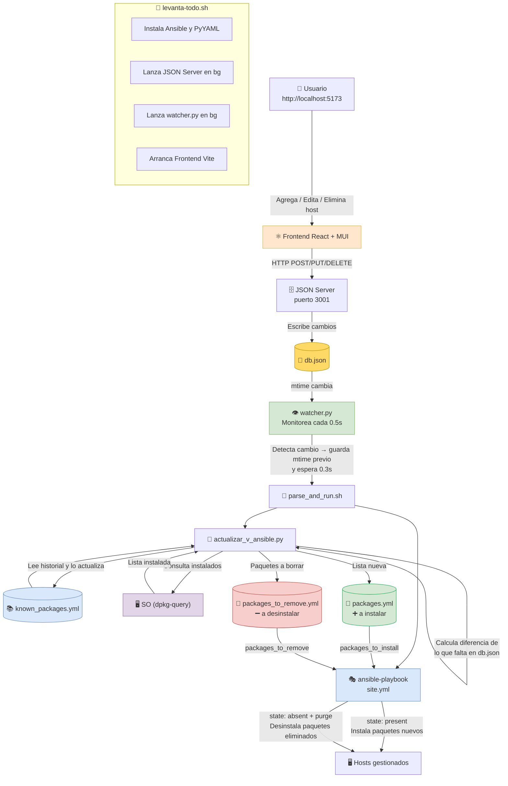

# 🖥️ IP Dashboard — Automatización con Ansible y Watcher

Panel web para gestionar hosts e instalar/desinstalar paquetes de forma totalmente automatizada. Cada vez que se agrega, edita o **elimina** un host desde la interfaz, el sistema **detecta el cambio, calcula qué paquetes instalar y cuáles remover, y ejecuta el playbook Ansible** de forma autónoma, sin intervención manual.

---

## 📐 Arquitectura general

```
Usuario (navegador)
      │
      │  HTTP REST (port 3001)
      ▼
JSON Server ──► db.json ◄── Watcher (Python)
                                │  detecta cambio de mtime
                                ▼
                        parse_and_run.sh
                          │           │
                          ▼           ▼
              actualizar_v_ansible.py   ansible-playbook site.yml
                          │
                          ▼
            ansible/host_vars/localhost/packages.yml
```

---

## 🧩 Componentes

### 1. Frontend (React + Material UI)

**Tecnologías:** React 19, Vite 7, MUI 7, json-server

El frontend es una **Single Page Application (SPA)** construida con React. Corre en `http://localhost:5173` (Vite dev server).

**¿Qué hace?**

- Muestra una grilla de tarjetas (cards), una por cada host registrado.
- Cada tarjeta muestra la **IP**, el **paquete a instalar** y el **sistema operativo**.
- Permite **agregar**, **editar** y **eliminar** hosts mediante formularios en diálogos modales.
- Todas las operaciones (crear, editar, eliminar) se realizan via **HTTP REST** contra el JSON Server.

**Archivos clave:**

| Archivo | Rol |
|---|---|
| `src/HostsGrid.jsx` | Componente principal: grilla de hosts, formularios CRUD |
| `src/App.jsx` | Shell de la aplicación |
| `src/main.jsx` | Punto de entrada de React |
| `index.html` | HTML base de Vite |
| `vite.config.js` | Configuración del bundler |

---

### 2. JSON Server (API REST + `db.json`)

**Puerto:** `3001`  
**Archivo de datos:** `db.json`

JSON Server actúa como **backend REST falso**. Lee y escribe directamente sobre `db.json`, exponiendo los endpoints estándar:

| Método | Endpoint | Acción |
|---|---|---|
| `GET` | `/hosts` | Lista todos los hosts |
| `POST` | `/hosts` | Crea un nuevo host |
| `PUT` | `/hosts/:id` | Actualiza un host |
| `DELETE` | `/hosts/:id` | Elimina un host |

**Estructura de `db.json`:**

```json
{
  "hosts": [
    {
      "id": "1",
      "ip": "192.168.0.10",
      "paquete": "nginx",
      "so": "Ubuntu 22.04"
    }
  ]
}
```

> Cada vez que el frontend hace un `POST`, `PUT` o `DELETE`, JSON Server **escribe inmediatamente** en `db.json`, lo que dispara la cadena de automatización.

---

### 3. Watcher (`watcher.py`)

El watcher es un **proceso Python en segundo plano** que monitorea continuamente el archivo `db.json`.

**¿Cómo funciona paso a paso?**

1. Al arrancar, espera a que `db.json` exista (por si aún no fue creado).
2. Registra el `mtime` (tiempo de última modificación) del archivo.
3. En un bucle cada **0.5 segundos**, compara el `mtime` actual con el anterior.
4. Si detecta un cambio:
   - Espera **0.3 segundos** extra para asegurarse de que el archivo terminó de escribirse.
   - **Guarda el `mtime` actual antes de ejecutar nada** (esto previene condiciones de carrera si el archivo vuelve a modificarse durante la ejecución de Ansible).
   - Ejecuta `bash parse_and_run.sh` como subproceso.
   - Actualiza el `mtime` de referencia con el valor guardado previamente.
5. Registra toda la actividad en `watcher.log`.

```
db.json cambia
     │
     ▼
watcher.py detecta nuevo mtime
     │
     ▼  (guarda mtime previo y espera 0.3s)
bash parse_and_run.sh
```

---

### 4. `parse_and_run.sh` — El puente entre datos y Ansible

Este script es el **orquestador** de la automatización. Se ejecuta cada vez que el watcher detecta un cambio.

**Pasos que realiza:**

```bash
PASO 1: python3 actualizar_v_ansible.py
PASO 2: ansible-playbook -i inventory.ini site.yml
```

**Paso 1 — Parse de `db.json`:**  
Invoca a `actualizar_v_ansible.py`, que:
- Lee `known_packages.yml` (un historial de **todos** los paquetes solicitados alguna vez).
- Lee `db.json` y extrae la lista **nueva** (deseados).
- Actualiza `known_packages.yml` con los nuevos paquetes.
- Consulta al sistema operativo con `dpkg-query` cuáles paquetes del historial están instalados realmente.
- Calcula la **diferencia**: paquetes que están instalados pero ya no están en los deseados → `packages_to_remove`.
- Genera **dos archivos** en `host_vars/localhost/`:

| Archivo | Variable | Qué contiene |
|---|---|---|
| `packages.yml` | `packages_to_install` | Paquetes que deben estar instalados |
| `packages_to_remove.yml` | `packages_to_remove` | Paquetes que hay que desinstalar |

**Ejemplo tras eliminar `nginx` del dashboard, sabiendo que estaba instalado:**
```yaml
# packages.yml
packages_to_install:
  - apache2
  - htop
  - mc

# packages_to_remove.yml
packages_to_remove:
  - nginx
```

**Paso 2 — Ejecución del Playbook:**  
Entra al directorio `ansible/` y ejecuta el playbook `site.yml`.

---

### 5. Ansible Playbook (`ansible/`)

**Estructura:**
```
ansible/
├── inventory.ini                    # Hosts gestionados (localhost)
├── site.yml                         # Playbook principal
├── roles/
│   └── install_packages/
│       ├── defaults/main.yml        # packages_to_install: [], packages_to_remove: []
│       └── tasks/main.yml           # Instala Y desinstala según las variables
└── host_vars/
    └── localhost/
        ├── packages.yml             # ← Generado automáticamente (instalar)
        └── packages_to_remove.yml   # ← Generado automáticamente (desinstalar)
```

**`site.yml`** aplica el rol `install_packages` sobre todos los hosts del grupo `managed_hosts`. El rol ejecuta **dos fases**:

| Fase | Variable usada | `state` Ansible | Efecto |
|---|---|---|---|
| Instalación | `packages_to_install` | `present` | Instala paquetes nuevos |
| Desinstalación | `packages_to_remove` | `absent + purge` | Desinstala paquetes eliminados |

---

## 🚀 Cómo levantar el proyecto

### Requisitos previos

- **Node.js 22+** (ver `download-node22.sh` para instalación)
- **Python 3**
- **Ansible** (se instala automáticamente si no está presente)

### Inicio con un solo comando

```bash
bash levanta-todo.sh
```

**¿Qué hace `levanta-todo.sh`?**

1. Verifica e instala **Ansible** si no está disponible (`sudo apt install ansible`).
2. Instala la dependencia de Python **PyYAML** (`pip install pyyaml`).
3. Lanza **JSON Server** en background (`http://localhost:3001`), guardando logs en `json-server.log`.
4. Lanza el **Watcher** (`watcher.py`) en background, guardando logs en `watcher.log`.
5. Instala dependencias de Node (`npm ci`) y arranca el **frontend** con `npm run dev`.
6. Al detener el frontend (Ctrl+C), mata automáticamente los procesos de JSON Server y Watcher.

---

## 🔄 Flujo completo: agregar un host con un paquete

```
1. El usuario abre el navegador en http://localhost:5173
2. Hace clic en "+ Nuevo Host"
3. Completa: IP, Paquete, Sistema Operativo → "Crear"
4. El frontend envía POST http://localhost:3001/hosts
5. JSON Server persiste el nuevo host en db.json
6. watcher.py detecta que db.json cambió (mtime diferente)
7. watcher.py ejecuta: bash parse_and_run.sh
8. parse_and_run.sh → python3 actualizar_v_ansible.py
   → Lee packages.yml anterior (lista vieja)
   → Lee db.json nuevo, extrae paquetes únicos
   → packages_to_remove = [] (no hay paquetes eliminados)
   → Escribe packages.yml y packages_to_remove.yml
9. parse_and_run.sh → ansible-playbook -i inventory.ini site.yml
   → Ansible instala el nuevo paquete (state: present)
10. Todo queda registrado en watcher.log
```

---

## 🗑️ Flujo completo: eliminar un host (desinstalación automática)

```
1. El usuario hace clic en el ícono 🗑️ de una tarjeta y confirma
2. El frontend envía DELETE http://localhost:3001/hosts/:id
3. JSON Server elimina el host de db.json
4. watcher.py detecta que db.json cambió (mtime diferente)
   → Guarda el valor de mtime de forma segura antes de lanzar Ansible, para no perderse cambios futuros rápidos
5. watcher.py ejecuta: bash parse_and_run.sh
6. parse_and_run.sh → python3 actualizar_v_ansible.py
   ┌─ Lee known_packages.yml (Historial): [nginx, htop, mc]
   ├─ Consulta al SO con dpkg-query cuáles de esos paquetes están instalados realmente
   ├─ Lee db.json NUEVO:         [htop, mc]        ← nginx fue excluido vía frontend
   ├─ packages_to_remove = [nginx]                 ← Instalados que NO están en los Deseados
   ├─ Sobreescribe packages.yml  → [htop, mc]
   └─ Escribe packages_to_remove.yml → [nginx]
7. parse_and_run.sh → ansible-playbook -i inventory.ini site.yml
   → Fase 1 (instalar):    state: present  → htop, mc (ya instalados, sin cambios)
   → Fase 2 (desinstalar): state: absent   → nginx  ← SE DESINSTALA
                            + purge: yes   → elimina archivos de config
                            + autoremove   → limpia dependencias huérfanas
8. Ansible reporta "nginx DESINSTALADO"
9. Todo queda registrado en watcher.log
```

---

## 📊 Diagrama de flujo (Mermaid)



---

## 📁 Estructura del proyecto

```
material-ui/
├── src/
│   ├── HostsGrid.jsx       # Componente principal del frontend
│   ├── App.jsx
│   └── main.jsx
├── ansible/
│   ├── site.yml            # Playbook Ansible
│   ├── inventory.ini       # Inventario de hosts
│   ├── roles/
│   │   └── install_packages/
│   └── host_vars/
│       └── localhost/
│           ├── packages.yml             # ← Generado automáticamente (instalar)
│           └── packages_to_remove.yml   # ← Generado automáticamente (desinstalar)
├── db.json                 # Base de datos REST (JSON Server)
├── watcher.py              # Watcher de cambios en db.json
├── parse_and_run.sh        # Orquestador: parseo + ejecución Ansible
├── actualizar_v_ansible.py # Parser de db.json → packages.yml
├── levanta-todo.sh         # Script de inicio único
├── watcher.log             # Logs del watcher (auto-generado)
├── json-server.log         # Logs del JSON Server (auto-generado)
└── package.json            # Dependencias Node (React, Vite, MUI)
```

---

## 🛠️ Tecnologías utilizadas

| Capa | Tecnología | Versión |
|---|---|---|
| Frontend | React | 19 |
| UI Components | Material UI (MUI) | 7 |
| Bundler | Vite | 7 |
| API REST mock | JSON Server | 1.x beta |
| Watcher | Python 3 | 3.x |
| Automatización | Ansible | 2.x+ |
| Scripts | Bash | — |
