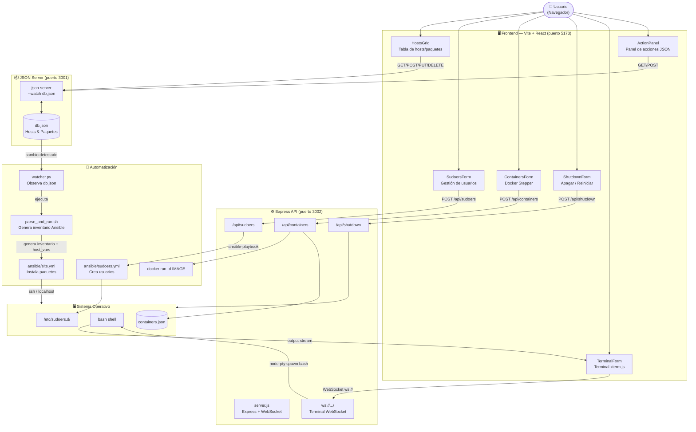

# 🖥️ IP Dashboard — Panel de Administración de Infraestructura

> Panel web para gestionar hosts remotos, paquetes, usuarios sudoers, contenedores Docker y un terminal interactivo, todo desde el navegador.

---

## 📋 Tabla de Contenidos

1. [¿Qué hace este proyecto?](#-qué-hace-este-proyecto)
2. [Arquitectura del sistema](#-arquitectura-del-sistema)
3. [Diagrama de flujo](#-diagrama-de-flujo)
4. [Estructura de carpetas](#-estructura-de-carpetas)
5. [Requisitos previos](#-requisitos-previos)
6. [Cómo replicar el ambiente desde cero](#-cómo-replicar-el-ambiente-desde-cero)
7. [Cómo arrancar el proyecto](#-cómo-arrancar-el-proyecto)
8. [Servicios y puertos](#-servicios-y-puertos)
9. [Descripción de cada módulo del frontend](#-descripción-de-cada-módulo-del-frontend)
10. [API REST — Endpoints disponibles](#-api-rest--endpoints-disponibles)
11. [Ansible — Automatización](#-ansible--automatización)
12. [Archivos de datos](#-archivos-de-datos)
13. [Logs del sistema](#-logs-del-sistema)
14. [Preguntas frecuentes (FAQ)](#-preguntas-frecuentes-faq)

---

## 🤔 ¿Qué hace este proyecto?

Este proyecto es un **panel de administración web** que permite, desde un browser, realizar las siguientes tareas sobre el servidor local y hosts remotos:

| Funcionalidad | ¿Qué hace? |
|---|---|
| 🌐 **Hosts / Paquetes** | Gestión de hosts remotos con IP, sistema operativo y paquete a instalar. Cuando guardás un cambio en `db.json`, Ansible lo aplica automáticamente. |
| 👤 **Sudoers** | Crea usuarios del sistema con contraseña y los agrega a `/etc/sudoers.d/` usando Ansible. |
| 🐳 **Contenedores Docker** | Levanta contenedores Docker especificando imagen y nombre opcional. Registra los contenedores en `containers.json`. |
| ⚡ **Apagar / Reiniciar** | Envía comandos `shutdown -h now` o `shutdown -r now` al servidor. |
| 🖥️ **Terminal Interactivo** | Terminal bash completo en el navegador via WebSocket + xterm.js + node-pty. |

---

## 🏗️ Arquitectura del sistema

El proyecto tiene **tres capas** bien diferenciadas:

```
┌─────────────────────────────────────────────────────────┐
│                     NAVEGADOR (Browser)                 │
│          React + Material UI + xterm.js                 │
│                    Puerto: 5173                         │
└──────────────────────┬──────────────────────────────────┘
                       │ HTTP REST / WebSocket
          ┌────────────┴────────────┐
          │                         │
          ▼                         ▼
┌──────────────────┐    ┌───────────────────────┐
│   JSON Server    │    │    Express API Server  │
│   Puerto: 3001   │    │     Puerto: 3002        │
│   (db.json CRUD) │    │  (Ansible, Docker,      │
└──────────────────┘    │   Shutdown, Terminal)   │
                        └──────────┬──────────────┘
                                   │ execFile / node-pty
                    ┌──────────────┴──────────────┐
                    │                              │
                    ▼                              ▼
          ┌──────────────────┐         ┌──────────────────┐
          │     Ansible      │         │   Docker / Shell  │
          │  site.yml        │         │  shutdown, bash   │
          │  sudoers.yml     │         └──────────────────┘
          └──────────────────┘

          ┌──────────────────────────────┐
          │     Python Watcher           │
          │   (watcher.py)               │
          │   Observa db.json →          │
          │   ejecuta parse_and_run.sh   │
          └──────────────────────────────┘
```

### ¿Por qué dos backends?

- **JSON Server** (`:3001`): Es un servidor REST automático que usa `db.json` como base de datos. El frontend puede hacer GET, POST, PUT, DELETE sin escribir código backend. Es perfecto para prototipado rápido.
- **Express API** (`:3002`): Maneja operaciones que requieren ejecutar comandos del sistema operativo: Ansible, Docker, shutdown, y el terminal interactivo.

---

## 📊 Diagrama de flujo


```mermaid
flowchart TD
    User(["👤 Usuario\n(Navegador)"])

    subgraph Frontend ["🖥️ Frontend — Vite + React (puerto 5173)"]
        HostsGrid["HostsGrid\nTabla de hosts/paquetes"]
        SudoersForm["SudoersForm\nGestión de usuarios"]
        ContainersForm["ContainersForm\nDocker Stepper"]
        ShutdownForm["ShutdownForm\nApagar / Reiniciar"]
        TerminalForm["TerminalForm\nTerminal xterm.js"]
        ActionPanel["ActionPanel\nPanel de acciones JSON"]
    end

    subgraph Backend1 ["📦 JSON Server (puerto 3001)"]
        JSONServer["json-server\n--watch db.json"]
        DBJson[("db.json\nHosts & Paquetes")]
    end

    subgraph Backend2 ["⚙️ Express API (puerto 3002)"]
        APIServer["server.js\nExpress + WebSocket"]
        SudoersEndpoint["/api/sudoers"]
        ContainersEndpoint["/api/containers"]
        ShutdownEndpoint["/api/shutdown"]
        WSEndpoint["ws://.../ \nTerminal WebSocket"]
    end

    subgraph Automatizacion ["🤖 Automatización"]
        Watcher["watcher.py\nObserva db.json"]
        ParseScript["parse_and_run.sh\nGenera inventario Ansible"]
        AnsibleSite["ansible/site.yml\nInstala paquetes"]
        AnsibleSudoers["ansible/sudoers.yml\nCrea usuarios"]
        DockerCmd["docker run -d IMAGE"]
    end

    subgraph Sistema ["🖥️ Sistema Operativo"]
        Shell["bash shell"]
        SudoersD["/etc/sudoers.d/"]
        ContainersJSON[("containers.json")]
    end

    User --> HostsGrid
    User --> SudoersForm
    User --> ContainersForm
    User --> ShutdownForm
    User --> TerminalForm
    User --> ActionPanel

    HostsGrid -- "GET/POST/PUT/DELETE" --> JSONServer
    JSONServer <--> DBJson

    DBJson -- "cambio detectado" --> Watcher
    Watcher -- "ejecuta" --> ParseScript
    ParseScript -- "genera inventario + host_vars" --> AnsibleSite
    AnsibleSite -- "ssh / localhost" --> Sistema

    SudoersForm -- "POST /api/sudoers" --> SudoersEndpoint
    SudoersEndpoint -- "ansible-playbook" --> AnsibleSudoers
    AnsibleSudoers --> SudoersD

    ContainersForm -- "POST /api/containers" --> ContainersEndpoint
    ContainersEndpoint --> DockerCmd
    ContainersEndpoint --> ContainersJSON

    ShutdownForm -- "POST /api/shutdown" --> ShutdownEndpoint
    ShutdownEndpoint --> Sistema

    TerminalForm -- "WebSocket ws://" --> WSEndpoint
    WSEndpoint -- "node-pty spawn bash" --> Shell
    Shell -- "output stream" --> TerminalForm

    ActionPanel -- "GET/POST" --> JSONServer
```

---

## 📁 Estructura de carpetas

```
material-ui/
├── levanta-todo.sh          # 🚀 Script principal que arranca todo
├── package.json             # Dependencias raíz (legacy)
├── download-node22.sh       # Helper para instalar Node.js 22
│
├── backend/                 # ⚙️ Toda la lógica del servidor
│   ├── server.js            # Express API en puerto 3002 + WebSocket
│   ├── watcher.py           # Observador de cambios en db.json
│   ├── parse_and_run.sh     # Genera inventario Ansible y lo ejecuta
│   ├── actualizar_v_ansible.py  # Script auxiliar para actualizar Ansible
│   ├── db.json              # Base de datos JSON (hosts y paquetes)
│   ├── containers.json      # Registro de contenedores Docker creados
│   ├── package.json         # Dependencias del backend (express, ws, node-pty)
│   └── ansible/
│       ├── inventory.ini    # Inventario Ansible (generado dinámicamente)
│       ├── site.yml         # Playbook principal: instalar paquetes
│       ├── sudoers.yml      # Playbook: crear usuarios sudoers
│       ├── host_vars/       # Variables por host (generadas por parse_and_run.sh)
│       └── roles/
│           ├── install_packages/   # Rol para instalar paquetes apt
│           └── sudoers/            # Rol para crear usuarios
│
├── frontend/                # 🖥️ Aplicación React
│   ├── index.html           # HTML raíz
│   ├── vite.config.js       # Configuración de Vite
│   ├── package.json         # Dependencias del frontend
│   └── src/
│       ├── main.jsx         # Punto de entrada React
│       ├── App.jsx          # Componente raíz
│       ├── HostsGrid.jsx    # Tabla de hosts y paquetes
│       ├── SudoersForm.jsx  # Formulario de usuarios sudoers
│       ├── ContainersForm.jsx   # Stepper para Docker
│       ├── ShutdownForm.jsx # Apagar / reiniciar
│       ├── TerminalForm.jsx # Terminal xterm.js
│       ├── ActionPanel.jsx  # Panel de acciones combinadas
│       ├── JsonBuilderForm.jsx  # Constructor de JSON
│       └── JsonOutputForm.jsx   # Visualizador de JSON
│
├── dist/                    # Build de producción del frontend (generado)
└── *.log                    # Logs de cada servicio
```

---

## ✅ Requisitos previos

Antes de arrancar el proyecto, el sistema necesita tener instalado:

| Herramienta | Versión mínima | ¿Para qué se usa? |
|---|---|---|
| **Node.js** | v22+ | Correr el backend Express y el frontend Vite |
| **npm** | v10+ | Gestión de dependencias JavaScript |
| **Python 3** | v3.8+ | El watcher y el script de Ansible |
| **pip / PyYAML** | cualquiera | El watcher necesita `pyyaml` |
| **Ansible** | v2.10+ | Automatizar instalación de paquetes y usuarios |
| **Docker** | v20+ | Gestión de contenedores (opcional si no usás esa feature) |
| **sudo** | — | El servidor Express ejecuta comandos privilegiados |

> **Tip para principiantes:** Si no tenés Node.js v22, usá el script incluido:
> ```bash
> bash download-node22.sh
> ```

---

## 🚀 Cómo replicar el ambiente desde cero

### Paso 1 — Clonar o copiar el repositorio

```bash
# Si tenés git:
git clone <URL_DEL_REPO> ~/material-ui
cd ~/material-ui

# Si tenés un zip/tarball:
unzip proyecto.zip -d ~/material-ui
cd ~/material-ui
```

### Paso 2 — Instalar Node.js 22 (si no lo tenés)

```bash
# Opción A: Script incluido en el repo
bash download-node22.sh

# Opción B: NodeSource (Ubuntu/Debian)
curl -fsSL https://deb.nodesource.com/setup_22.x | sudo -E bash -
sudo apt install -y nodejs

# Verificar instalación:
node --version   # debe mostrar v22.x.x
npm --version    # debe mostrar v10.x.x
```

### Paso 3 — Instalar Ansible

```bash
sudo apt update
sudo apt install -y ansible

# Verificar:
ansible --version
```

### Paso 4 — Instalar Python y PyYAML

```bash
# Python3 suele venir preinstalado en Ubuntu/Debian:
python3 --version

# Instalar PyYAML:
sudo apt install -y python3-pip
pip3 install pyyaml
# o si estás en Ubuntu 24+:
pip3 install --break-system-packages pyyaml
```

### Paso 5 — Instalar Docker (opcional)

```bash
# Instalar Docker Engine en Ubuntu/Debian:
sudo apt install -y docker.io
sudo systemctl enable --now docker

# Agregar tu usuario al grupo docker para evitar usar sudo siempre:
sudo usermod -aG docker $USER
newgrp docker

# Verificar:
docker --version
docker ps
```

### Paso 6 — Configurar sudoers para comandos sin contraseña

El backend necesita ejecutar `shutdown` y `docker` con `sudo` sin que te pida contraseña. Creá un archivo de sudoers:

```bash
# Reemplazá "devops" con tu usuario actual:
echo "devops ALL=(ALL) NOPASSWD: /sbin/shutdown, /usr/bin/docker" | \
  sudo tee /etc/sudoers.d/ip-dashboard

# Verificar que no haya errores de sintaxis:
sudo visudo -c
```

### Paso 7 — Instalar dependencias del proyecto

El script `levanta-todo.sh` hace esto automáticamente, pero si querés hacerlo manualmente:

```bash
# Backend:
cd ~/material-ui/backend
npm install

# Frontend:
cd ~/material-ui/frontend
npm install
```

### Paso 8 — Arrancar el proyecto

```bash
cd ~/material-ui
bash levanta-todo.sh
```

El script hace lo siguiente en orden:
1. Verifica que Ansible esté instalado (si no, lo instala).
2. Instala PyYAML para Python.
3. Instala dependencias npm del backend.
4. Instala dependencias npm del frontend.
5. Arranca **JSON Server** en background (`:3001`).
6. Arranca **Express API** en background (`:3002`).
7. Arranca **Python Watcher** en background.
8. Arranca el **frontend Vite** en primer plano (`:5173`).

Cuando querés detener todo, presioná `Ctrl+C`. El script mata automáticamente los procesos en background.

### Paso 9 — Abrir el panel en el navegador

```
http://localhost:5173
```

Si estás accediendo desde otra máquina en la red:
```
http://<IP_DEL_SERVIDOR>:5173
```

---

## 🌐 Servicios y puertos

| Servicio | Puerto | Descripción | Iniciado por |
|---|---|---|---|
| **Frontend (Vite)** | `5173` | Interfaz React en modo desarrollo | `levanta-todo.sh` |
| **JSON Server** | `3001` | API REST automática de `db.json` | `levanta-todo.sh` |
| **Express API** | `3002` | Backend con lógica de negocio + WebSocket | `levanta-todo.sh` |
| **WebSocket Terminal** | `3002` | Mismo servidor, upgrade a WS para la terminal | Express |

---

## 🧩 Descripción de cada módulo del frontend

### `HostsGrid.jsx`
Muestra una tabla de todos los hosts definidos en `db.json`. Permite agregar, editar y eliminar hosts (IP, sistema operativo, paquete a instalar). Cuando un paquete se agrega, el watcher lo detecta y Ansible lo instala automáticamente en el host correspondiente.

### `SudoersForm.jsx`
Formulario para crear usuarios del sistema. Campos:
- **Username**: nombre del usuario (solo letras minúsculas, números, guiones)
- **Password**: contraseña del nuevo usuario
- **¿Es root?**: switch para decidir si tendrá privilegios totales en sudoers

Al enviar, llama a `POST /api/sudoers` en el backend, que ejecuta el playbook `ansible/sudoers.yml`.

### `ContainersForm.jsx`
Stepper (asistente de 3 pasos) para crear contenedores Docker:
1. Ingresá la **imagen** (ej: `nginx`, `ubuntu:22.04`)
2. Opcionalmente, ingresá un **nombre** para el contenedor
3. El backend ejecuta `docker run -d IMAGE` y muestra el resultado de `docker ps`

El contenedor queda registrado en `containers.json`.

### `ShutdownForm.jsx`
Card con un switch que permite elegir entre:
- **Apagar** el servidor (`sudo shutdown -h now`)
- **Reiniciar** el servidor (`sudo shutdown -r now`)

⚠️ **Cuidado:** esta acción es real. Apagará el servidor donde está corriendo el backend.

### `TerminalForm.jsx`
Terminal interactiva en el navegador usando **xterm.js**. Se conecta por WebSocket a `ws://localhost:3002`. En el backend, se crea un proceso `bash` con **node-pty** (pseudo-terminal). Todo lo que escribís en el navegador se envía al bash real, y el output vuelve al browser en tiempo real.

### `ActionPanel.jsx`
Panel de acciones que permite ejecutar operaciones sobre los datos del JSON server: crear registros, actualizar estados, etc.

---

## 🔌 API REST — Endpoints disponibles

### JSON Server (`:3001`) — Generados automáticamente

| Método | URL | Descripción |
|---|---|---|
| `GET` | `http://localhost:3001/hosts` | Listar todos los hosts |
| `POST` | `http://localhost:3001/hosts` | Crear un host nuevo |
| `PUT` | `http://localhost:3001/hosts/:id` | Actualizar un host |
| `DELETE` | `http://localhost:3001/hosts/:id` | Eliminar un host |

### Express API (`:3002`) — Endpoints customizados

| Método | URL | Body (JSON) | Descripción |
|---|---|---|---|
| `POST` | `/api/sudoers` | `{ username, password, isRoot }` | Crea usuario del sistema |
| `POST` | `/api/containers` | `{ image, name? }` | Crea un contenedor Docker |
| `GET` | `/api/containers` | — | Lista contenedores registrados |
| `POST` | `/api/containers/batch` | `[{ image, name? }, ...]` | Crea múltiples contenedores |
| `POST` | `/api/shutdown` | `{ reboot: true/false }` | Apaga o reinicia el servidor |
| `GET` | `/health` | — | Health check del servidor |
| `WS` | `ws://localhost:3002` | — | Terminal bash interactivo |

**Ejemplo con curl:**

```bash
# Crear un usuario sudoer:
curl -X POST http://localhost:3002/api/sudoers \
  -H "Content-Type: application/json" \
  -d '{"username": "pepe", "password": "Segura123!", "isRoot": false}'

# Ver contenedores registrados:
curl http://localhost:3002/api/containers

# Crear un contenedor nginx:
curl -X POST http://localhost:3002/api/containers \
  -H "Content-Type: application/json" \
  -d '{"image": "nginx", "name": "mi-nginx"}'
```

---

## 🤖 Ansible — Automatización

### ¿Cómo funciona el flujo automático de paquetes?

```
1. El usuario agrega/modifica un host en la UI
        ↓
2. La UI hace PUT/POST a JSON Server → actualiza db.json
        ↓
3. watcher.py detecta el cambio (compara mtime del archivo)
        ↓
4. Ejecuta parse_and_run.sh
        ↓
5. parse_and_run.sh lee db.json, genera:
   - ansible/inventory.ini  (lista de IPs)
   - ansible/host_vars/<IP>/packages.yml  (paquete a instalar)
        ↓
6. Ejecuta: ansible-playbook ansible/site.yml
        ↓
7. Ansible se conecta a cada host por SSH e instala el paquete con apt
```

### Playbooks disponibles

#### `ansible/site.yml` — Instalar paquetes
Se ejecuta automáticamente. Usa el rol `install_packages` para instalar los paquetes definidos en `host_vars/`.

#### `ansible/sudoers.yml` — Crear usuarios
Se ejecuta desde el backend cuando se usa el formulario de Sudoers. Variables requeridas:
- `sudoers_user`: nombre de usuario
- `sudoers_password`: contraseña en texto plano (Ansible la hashea)
- `sudoers_is_root`: `true` o `false`

---

## 📄 Archivos de datos

### `backend/db.json`

Base de datos principal que usa JSON Server. Estructura:

```json
{
  "hosts": [
    {
      "id": "1",
      "ip": "192.168.0.10",
      "paquete": "nginx",
      "so": "Ubuntu 22.04"
    }
  ]
}
```

| Campo | Tipo | Descripción |
|---|---|---|
| `id` | string | Identificador único (auto-generado por JSON Server) |
| `ip` | string | Dirección IP del host a gestionar |
| `paquete` | string | Paquete apt que se instalará en ese host |
| `so` | string | Sistema operativo (solo informativo) |

### `backend/containers.json`

Registro de contenedores Docker creados desde el panel:

```json
[
  {
    "image": "nginx",
    "name": "mi-nginx",
    "timestamp": "2025-03-12T17:30:00.000Z"
  }
]
```

---

## 📋 Logs del sistema

Cada servicio escribe en su propio archivo de log en la raíz del proyecto:

| Archivo | Servicio | ¿Dónde ver errores? |
|---|---|---|
| `json-server.log` | JSON Server | Errores de la API REST automática |
| `app.log` | Express API | Errores del servidor y de Ansible |
| `api-server.log` | Express API | Output adicional del servidor |
| `watcher.log` | Python Watcher | Detecciones de cambios y ejecuciones |

Para seguir los logs en tiempo real:

```bash
# Ver todos los logs a la vez:
tail -f json-server.log app.log watcher.log

# Solo el watcher:
tail -f watcher.log

# Solo el backend Express:
tail -f app.log
```

---

## ❓ Preguntas frecuentes (FAQ)

**¿Por qué el watcher no detecta los cambios?**
Verificá que `watcher.py` esté corriendo: `ps aux | grep watcher.py`. Si se detuvo, revisá `watcher.log` para ver el error y corré el script principal de vuelta.

**¿Por qué Ansible da error de conexión SSH?**
Para los hosts remotos, necesitás haber copiado tu clave SSH pública a esos hosts:
```bash
ssh-keygen -t ed25519    # Si no tenés clave SSH
ssh-copy-id usuario@192.168.0.10
```
Para el host local (`127.0.0.1`), Ansible usa `connection: local` y no necesita SSH.

**¿El terminal interactivo no conecta?**
Verificá que el backend Express esté corriendo en `:3002` y que el navegador pueda acceder a ese puerto. También revisá que `node-pty` esté bien instalado en `backend/node_modules`:
```bash
ls backend/node_modules/node-pty
```

**¿Cómo agrego un host nuevo para que Ansible lo gestione?**
1. Usá la interfaz web (HostsGrid) para agregar la IP, paquete y SO.
2. Verificá que el host sea accesible por SSH desde este servidor.
3. El watcher detectará el cambio y ejecutará Ansible automáticamente.

**¿Puedo correr el frontend y backend por separado?**
Sí. En terminales separadas:
```bash
# Terminal 1 — JSON Server:
cd backend && npx json-server --watch db.json --port 3001

# Terminal 2 — Express API:
cd backend && node server.js

# Terminal 3 — Python Watcher:
python3 backend/watcher.py

# Terminal 4 — Frontend:
cd frontend && npm run dev
```

**¿Cómo hago un build de producción del frontend?**
```bash
cd frontend
npm run build
# Los archivos quedan en frontend/dist/
# Podés servirlos con cualquier servidor web estático (nginx, caddy, etc.)
```

---

## 🛠️ Stack tecnológico

| Capa | Tecnología | Versión |
|---|---|---|
| Frontend | React | 19.x |
| Frontend UI | Material UI (MUI) | 7.x |
| Frontend Build | Vite | 7.x |
| Frontend Terminal | xterm.js | 6.x |
| Backend API | Express.js | 5.x |
| Backend DB | JSON Server | 1.x (beta) |
| Backend Terminal | node-pty + ws | latest |
| Automatización | Ansible | 2.10+ |
| Watcher | Python 3 | 3.8+ |
| Contenedores | Docker | 20+ |

---

## 📝 Licencia

Proyecto interno / de uso personal. Sin licencia definida.
